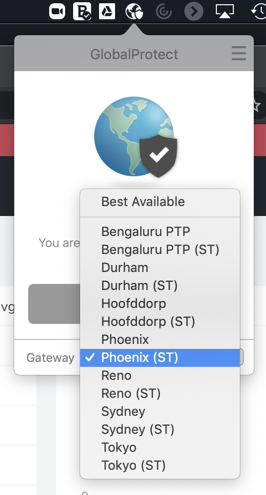

.. _clusteraccess:

----------------------
Accessing Your Cluster
----------------------

Clusters used for **Hands on Learning** run within the Hosted POC environment, hosted in the Nutanix PHX and RTP data centers.

In order to access these resources you must be connected by one of the options listed below. Connection to a virtual desktop environment **is not necessary**, but details for connecting to the HPOC through an HTML5 Frame desktop is available for those experiencing issues with the VPN or unable to install VPN software.

Nutanix Employee VPN
....................

Log in to https://gp.nutanix.com using your OKTA credentials.

Download and install the appropriate GlobalProtect agent for your operating system.

Launch GlobalProtect and configure **gp.nutanix.com** as the **Portal** address.

Connect using your **Okta** credentials.

Using the **Gateway** dropdown, select a Split Tunnel (ST) gateway to ensure only network traffic targeting the Hosted POC environment is sent over the VPN (Otherwise **Best Available** will default to a full VPN tunnel). Regardless if using a **PHX** or **RTP** cluster, **Hoofddorp (ST)** is recommended.

.. note::

   If you experience issues connecting to the GlobalProtect VPN, Nutanix IT resources are on standby in #corp-it on Slack to assist.

**If you are able to connect with the VPN, you can continue to the labs. You do not need to use a Frame desktop.**